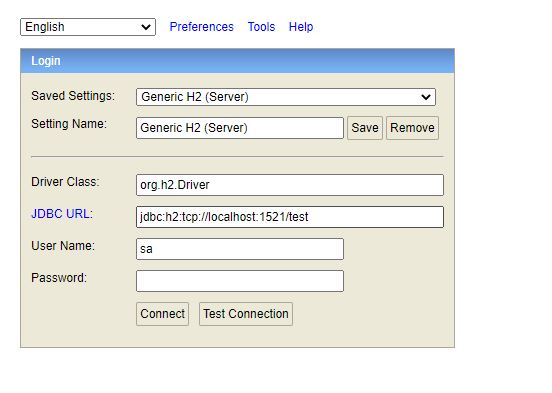
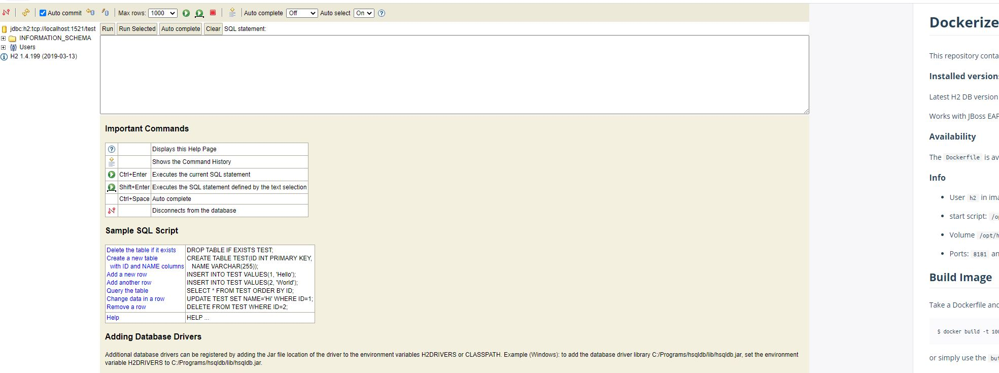

# H2 Database as Kubernetes Deployment

Running h2-database-service.yaml will create create
	
*   a database namespace
*   a database service 
* 	a H2 database deployment with 1 replica.

	$ kubectl apply -f spring-boot-flay-way-demo.yaml 
	namespace/database created
	service/database-service created
	deployment.apps/database created

	
	$ kubectl get all --namespace=database
	NAME                            READY   STATUS         RESTARTS   AGE
	pod/database-556f798d6c-p7w9p   0/1     ErrImagePull   0          16s
	
	NAME                       TYPE       CLUSTER-IP      EXTERNAL-IP   PORT(S)                       AGE
	service/database-service   NodePort   10.100.212.45   <none>        1521:30620/TCP,81:30003/TCP   19s
	
	NAME                       READY   UP-TO-DATE   AVAILABLE   AGE
	deployment.apps/database   0/1     1            0           19s
	
	NAME                                  DESIRED   CURRENT   READY   AGE
	replicaset.apps/database-556f798d6c   1         1         0       19s
	

H2 Data base will be available to access on port 30003

 	

 	