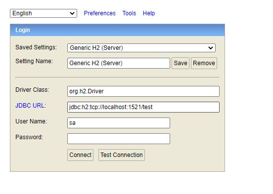
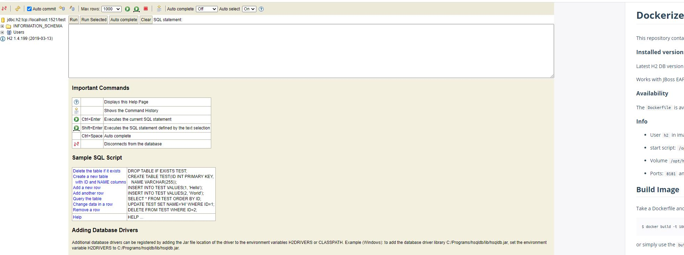

# H2 Database as Kubernetes Deployment

Running h2-database-service.yaml will create create
	
*   a database namespace
*   a database service 
* 	a H2 database deployment with 1 replica.

	$ kubectl apply -f spring-boot-flay-way-demo.yaml 
	namespace/database created
	service/database-service created
	deployment.apps/database created

	
	$ kubectl get all
	NAME                            READY   STATUS    RESTARTS   AGE
	pod/database-596449d445-tjkl8   1/1     Running   0          35s

	NAME                       TYPE        CLUSTER-IP     EXTERNAL-IP   PORT(S)                       AGE
	service/database-service   NodePort    10.106.69.91   <none>        1521:30727/TCP,81:30003/TCP   35s

	NAME                       READY   UP-TO-DATE   AVAILABLE   AGE
	deployment.apps/database   1/1     1            1           35s

	NAME                                  DESIRED   CURRENT   READY   AGE
	replicaset.apps/database-596449d445   1         1         1       35s
	

H2 Data base will be available to access on port 30003

 	

 	